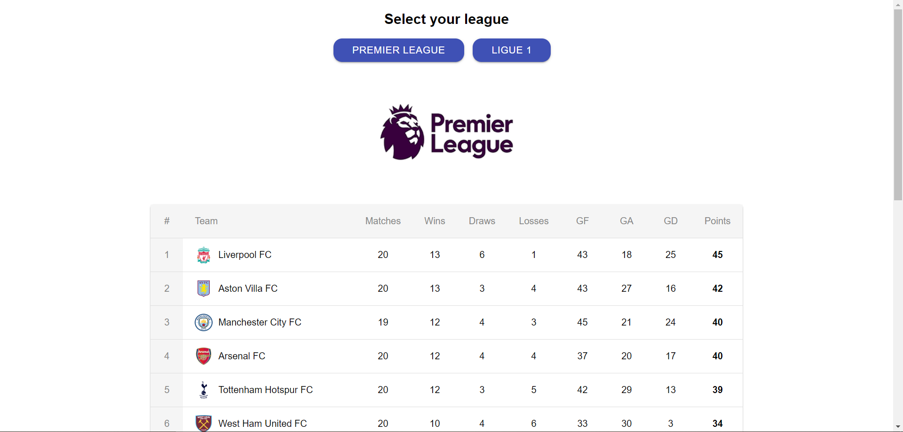

# Soccer Stats

This project was bootstrapped with [Create React App](https://github.com/facebook/create-react-app).

Soccer stats allows users to view the positions of soccer teams and their respective stats for the current Premier League and Ligue1.

To install the react.js frontend, open a terminal in the `client` directory and run: 
### `npm install`

followed by:
### `npm start`

To install the express.js backend, open a terminal in the `server` directory and run:
### `npm start`

Screenshot:

